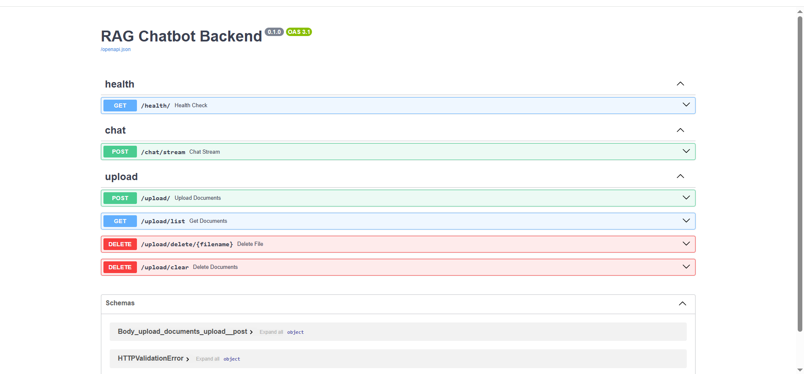
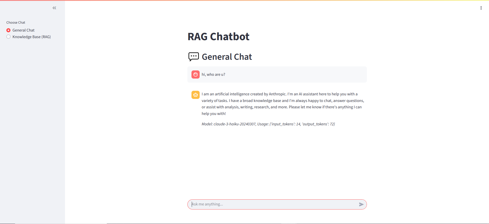
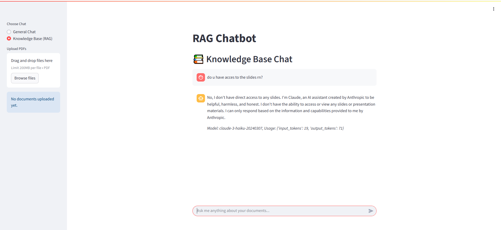
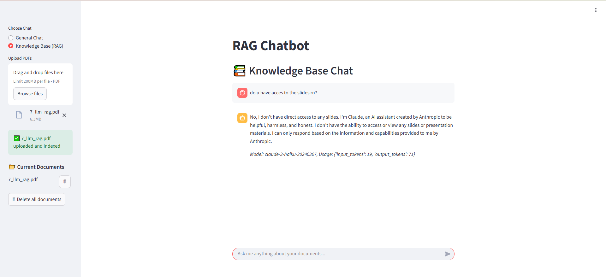
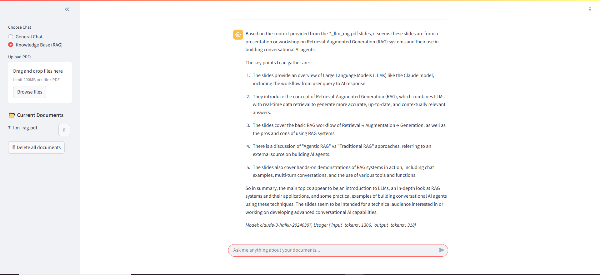
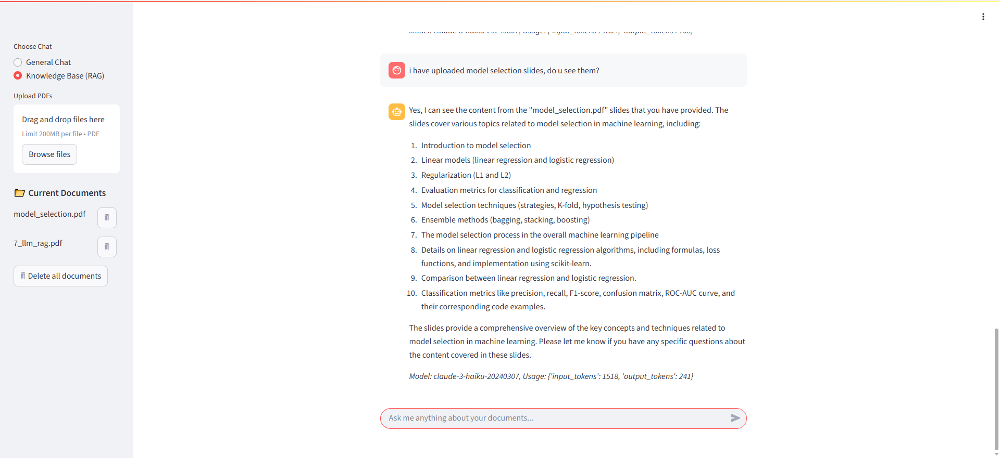
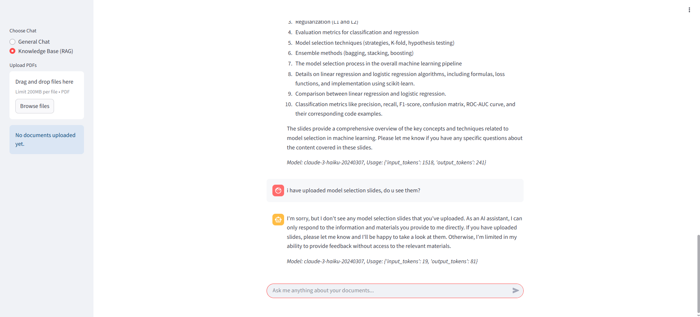

# RAG Chatbot Application

This project is a **Retrieval-Augmented Generation (RAG) chatbot** with the ability to switch between:
- **Ordinary Chat** – pure LLM mode (no external context).
- **RAG Chat** – augmented with uploaded documents for contextual answers.

The system uses **Claude 3 Haiku** as the underlying LLM.

---

## 🌐 Live Demo

- **Frontend (Streamlit App):** [http://44.219.51.68:8501/](http://44.219.51.68:8501/)  
- **Backend API Docs (FastAPI + Swagger):** [http://44.219.51.68:8000/docs](http://44.219.51.68:8000/docs)  

---

## ⚙️ Features

- **Dual chat modes**:
  - 🔹 *Ordinary Chat*: Standard LLM without external data.
  - 🔹 *RAG Chat*: Context-aware responses using uploaded documents.
- **PDF Uploads**:
  - Upload one or more PDF files.
  - Delete uploaded PDFs when no longer needed.
  - When a file is deleted:
    - It is removed from the FAISS index.
    - The file is deleted from disk (`/data/uploads`).
    - The model no longer has access to its contents.
- **Isolation Guarantee**:
  - Ordinary chat and RAG chat are isolated.
  - Non-RAG chat cannot access uploaded documents.
- **APIs**:
  - Interactive documentation available via FastAPI Swagger UI.

---

## 🛠️ Tech Stack

- **Frontend**: [Streamlit](https://streamlit.io/)  
- **Backend**: [FastAPI](https://fastapi.tiangolo.com/)  
- **Vector Database**: [FAISS](https://faiss.ai/)  
- **Embeddings**: [SentenceTransformers](https://www.sbert.net/)  
- **Document Handling**: PyPDF2  
- **Orchestration**: Docker + Docker Compose  

---

##  Running Locally

###  Clone the repository
```bash
git clone https://github.com/<your-username>/ml_ops_3.git
cd ml_ops_3
docker compose up --build -d
```
###  Stop the services

```bash
docker compose up --build -d
``` 

Backend runs at: http://localhost:8000

Frontend runs at: http://localhost:8501


### 📸 Screenshots of the Usage  

- Supports **RAG** and **non-RAG** chat modes.  
- Claude 3 Haiku integrated as the LLM.  
- Isolated document access between chat modes.  
- PDF Upload & Delete functionality.  

#### Backend API


#### Frontend Chat Interface
  


#### Upload / Delete Documents
  

  



